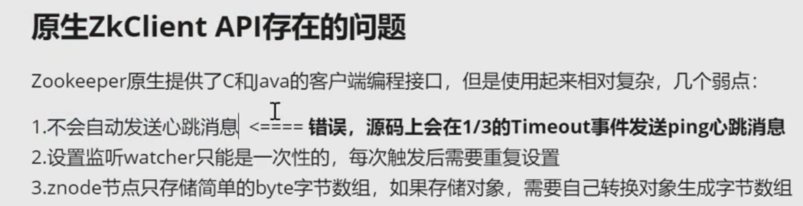

## 使用的三方库

- Protobuf 提供数据序列化(libprotoc 3.12.4)
- Muduo 底层网络库
- zookeeper 3.8.4


## 框架结构


对于客户端，方法首先暴露给用户调用，之后进行封装发送（MpRpcChannel）
    RpcController控制信息，对rpc框架内请求过程中出现的错误进行封装，暴露给用户进行错误处理
对于服务端，方法签名解析完成后(RpcProvider)，调用本地方法


日志：使用条件变量进行线程间通信。多生产单消费模型。日志业务的极低概率的虚假唤醒是可以忍受的
也可以使用`kafka`分布式日志存储

## zookeeper

zookeeper服务配置中心：所有rpc节点统一注册到配置中心，集中管理分发

介绍： https://www.cnblogs.com/xinyonghu/p/11031729.html

```
git clone --branch release-3.4.10 https://github.com/apache/zookeeper.git
cd zookeeper
cd conf
mv zoo_sample.cfg zoo.cfg # 将示例配置文件复制为zoo.cfg作为配置

cd ../bin
./zkServer.sh start # 启动zookeeper服务

```
可以通过`netstat`查看zkServer服务端口，在bin目录启动zkClient链接zkServer，熟悉zookeeper怎么组织节点


> C API编译 https://www.cnblogs.com/qiuliw/p/18958101




## mprpc 使用

1. protobuf 定义 service
2. callee 实现 class UserService : public fixbug::UserServiceRpc(要将proto自动生成的方法对接到本地方法) , Notify提交服务到rpc节点
3. caller fixbug::UserServiceRpc_Stub stub(new MpRpcChannel()); 连接节点，调用远程rpc方法，stub提供service签名


